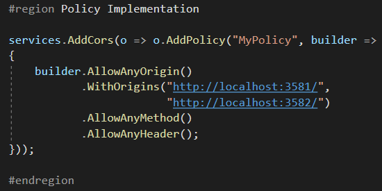
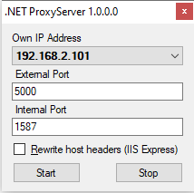
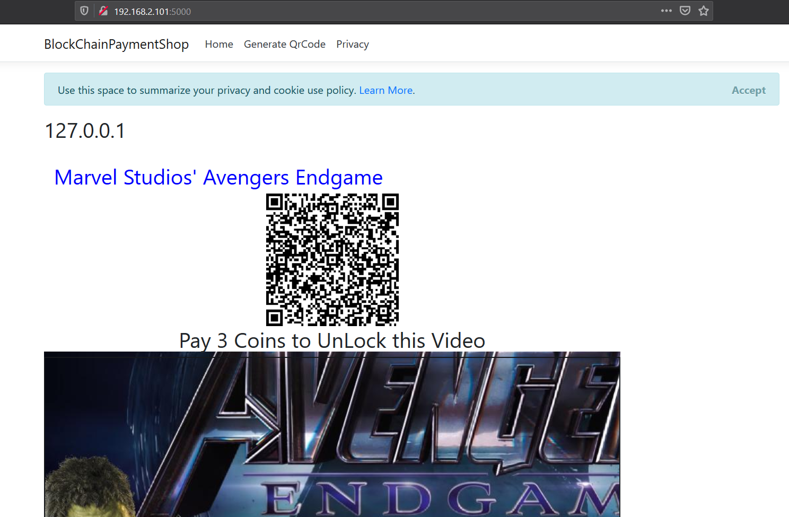
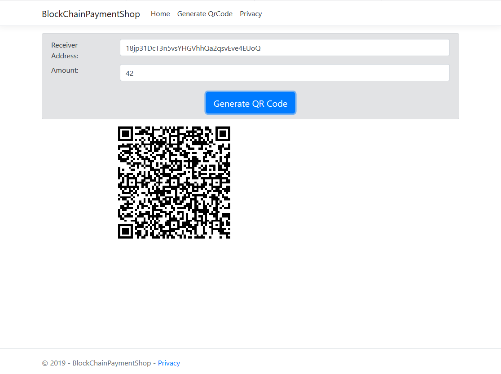
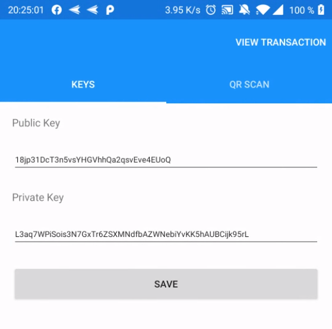
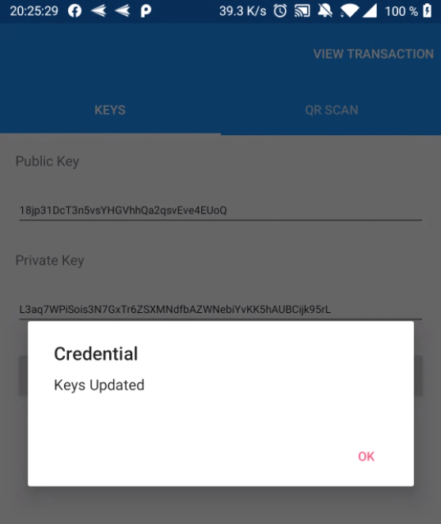
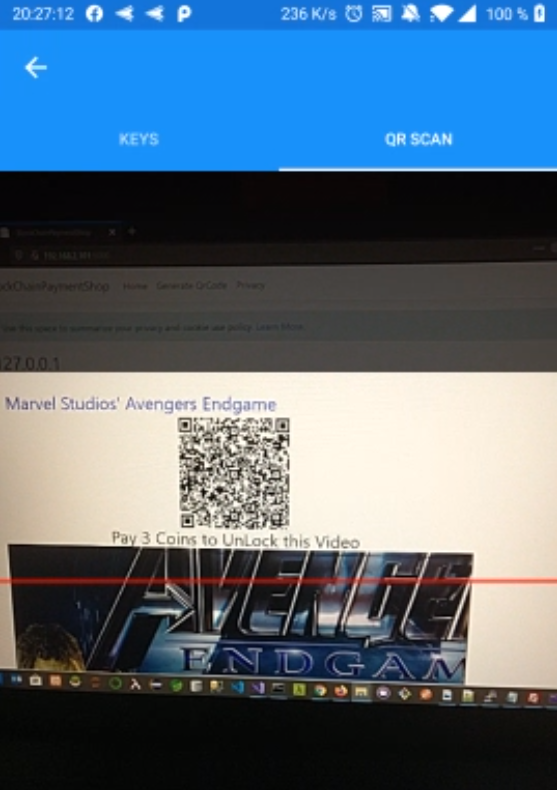
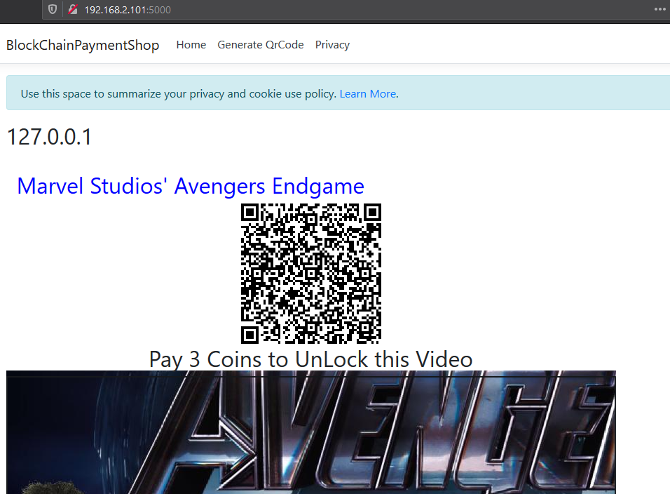

# [Blockchain Network & Blockchain Client + Xamarin Mobile Wallet App + QR Code based Payment Shop](https://github.com/dpedwards/dotnet-core-blockchain-advanced)

[](https://raw.githubusercontent.com/dpedwards/dotnet-core-blockchain-advanced/master/LICENSE)
[](https://dotnet.microsoft.com/download)
[](https://www.paypal.me/dare2101)

A blockchain is a growing list of records, called blocks. The blocks are linked using cryptography and each block contains a cryptographic hash of the previous block, transaction data, and a timestamp. 

## Projects

- BlockChain 
- BlockChain Client
- BlockchainPaymentShop
- XamarinWallet
- ProxyServer

## Notable features

- cryptography 
- process of creating blocks
- process of chaining blocks 
- network & mining
- wallet generator
- make transaction
- view transactions
- wallet transactions
- QR Code generator
- unlock videos with mobile wallet by scanning QR Code and paying cryptocurrency on blockchain
- proxy server
- etc.

## Notes to test the blockchain based payment system

There are 5 projects in this repository:

### I. Blockchain
1. Start a new instance of the BlockChain project in Visual Studio 2017+ from the BlockChainAdvanced Solution.
- Blockchain is listening on localhost port `63385`


You can edit the public and private key in CryptoCurrency.cs class:
- Fixed blockchain public key for easy testing: `18jp31DcT3n5vsYHGVhhQa2qsvEve4EUoQ`
- Fixed blockchain private key for easy testing: `L3aq7WPiSois3N7GxTr6ZSXMNdfbAZWNebiYvKK5hAUBCijk95rL`


Edit client access in Startup.cs class by changing the policy.

#### Blockchain Pictures 

Mine:


Add Node:


Blockchain Overview:


### II. Blockchain Client
2. Start a new instance of the BlockChain Client project in Visual Studio 2017+ if you want to generate new public or private keys, make transactions, view transactions by the blockchain listening on localhost port `63385` or show wallet transactions by adding a new public key. 
- Blockchain Client is listening on localhost port `3582`. 

#### Blockchain Client Pictures 

Wallet Generator:


Make Transaction:


View Transactions:
 

Wallet Transactions:
 


### III. Proxy Server
3. Start a new instance of the Proxy Server in Visual Studio and select the IP Address on your running machine you execute these projects. You can check the correct IP Address by cmd command ipconfig -all in Windows for example. The External Port must run on port `5000` and the Internal Port on port 1587.

#### Proxy Server Picture




3.1 Next access the URL in your browser on the IP Address of your running machine you execute these projecs and add the port 5000. This URL will access by the running instances. For example: http://192.168.2.101:5000

### IV. BlockchainPaymentShop
4. Edit the applicationhost.config file in dotnet-core-blockchain-advanced\BlockChainPayment\.vs\config\ path and edit the following bindings by your own IP Address set by the Proxy Server in section 3:
   ```yaml
   <binding protocol="http" bindingInformation="*:1587:localhost" />
   <binding protocol="http" bindingInformation="*:1587:xxx.xxx.xxx.xxx" />
   ```
Scan QR Code by XamarinWallet Android app to unlock a video:
 

Generate QR Code:
 


### V. XamarinWallet Android mobile app
5. Last activate the Android Developer features on your Android smartphone hardware and connect physically with a USB cable to your machine you running these projects.
5.1 Enable USB debugging option on your Android device.
5.2 Debug the XamarinWallet app in Visual Studio 2017+ with a USB cable connection to your workstation.
5.3 An instance of the mobile app should run on your Android device.
5.3.1 Next save the Public and the Private Keys by enter the SAVE button in the UI. A notification that the keys are updated should be shown. 
5.3.2 Tab to the QR SCAN UI and enter the SCAN QR CODE button.
5.3.3 Now scan a QR Code from the BlockChainPaymentShop URL http://xxx.xxx.xxx:5000 with your Android smartphone hardware and enter the PAY button to pay over the blockchain payment system to unlock a video.

Update Public and Private Keys:
 

 

Activate cam and scan QR Code:
 

Unlock BlockChainPaymentShop videos:
 
 


**If you enjoy this project, please consider [supporting me](https://www.paypal.me/dare2101) for developing and maintaining it.**

[](https://www.paypal.me/dare2101)

---

## Contributing

Having trouble working with the project? Found a typo in the documentation? Interested in adding a feature or [fixing a bug](https://github.com/dpedwards/dotnet-core-blockchain-advanced/issues)? Then by all means [submit an issue](https://github.com/dpedwards/dotnet-core-blockchain-advanced/issues/new) or [pull request](https://help.github.com/articles/using-pull-requests/). If this is your first pull request, it may be helpful to read up on the [GitHub Flow](https://guides.github.com/introduction/flow/) first.

### Pull Requests

When submitting a pull request:

1. Clone the repo.
2. Create a branch off of `master` and give it a meaningful name (e.g. `my-awesome-new-feature`).
3. Open a pull request on GitHub and describe the feature or fix.

project documentation and demo pages can be found in the [`/docs`](docs) if submitting improvements, typo corrections, etc.

---

## Credits

### Creator

**Davain Pablo Edwards**

- <https://soon.com>
- <https://twitter.com/d_p_edwards>
- <https://github.com/dpedwards>

### Requirements

- [Visual Studio](https://visualstudio.microsoft.com/de/vs/) or [Visual Studio Code](https://code.visualstudio.com/)
- [.NET Core](https://dotnet.microsoft.com/download)


### Packages:

#### BlockChain Project
- [Microsoft.NETCore.App](https://dotnet.microsoft.com/)
- [NBitcoin](https://github.com/MetacoSA/NBitcoin)
- [Newtonsoft.Json](https://www.newtonsoft.com/json)

#### BlockChainClient Project
- [Microsoft.NETCore.App](https://dotnet.microsoft.com/)
- [Microsoft.AspNetCore.Razor.Design](https://dotnet.microsoft.com/apps/aspnet)
- [Microsoft.NETCore.App](https://dotnet.microsoft.com/)

#### Xamarin-Wallet Project
- [NBitcoin](https://github.com/MetacoSA/NBitcoin)
- [Newtonsoft.Json](https://www.newtonsoft.com/json)
- [Xamarin.Forms](https://docs.microsoft.com/en-us/xamarin/xamarin-forms/) 
- [ZXing.Net.Mobile.Forms](https://github.com/Redth/ZXing.Net.Mobile)

#### BlockChainPaymentShop Project
- [Microsoft.AspNetCore.App](https://dotnet.microsoft.com/apps/aspnet)
- [Microsoft.AspNetCore.Razor.Design](https://dotnet.microsoft.com/apps/aspnet)
- [Microsoft.AspNetCore.SignalR](https://dotnet.microsoft.com/apps/aspnet)
- [Microsoft.NETCore.App](https://dotnet.microsoft.com/)

#### ProxyServer Project 
- [.NET](https://dotnet.microsoft.com/download)


---

## License

MIT License

Copyright (c) 2019 Davain Pablo Edwards

Permission is hereby granted, free of charge, to any person obtaining a copy
of this software and associated documentation files (the "Software"), to deal
in the Software without restriction, including without limitation the rights
to use, copy, modify, merge, publish, distribute, sublicense, and/or sell
copies of the Software, and to permit persons to whom the Software is
furnished to do so, subject to the following conditions:

The above copyright notice and this permission notice shall be included in all
copies or substantial portions of the Software.

THE SOFTWARE IS PROVIDED "AS IS", WITHOUT WARRANTY OF ANY KIND, EXPRESS OR
IMPLIED, INCLUDING BUT NOT LIMITED TO THE WARRANTIES OF MERCHANTABILITY,
FITNESS FOR A PARTICULAR PURPOSE AND NONINFRINGEMENT. IN NO EVENT SHALL THE
AUTHORS OR COPYRIGHT HOLDERS BE LIABLE FOR ANY CLAIM, DAMAGES OR OTHER
LIABILITY, WHETHER IN AN ACTION OF CONTRACT, TORT OR OTHERWISE, ARISING FROM,
OUT OF OR IN CONNECTION WITH THE SOFTWARE OR THE USE OR OTHER DEALINGS IN THE
SOFTWARE.
